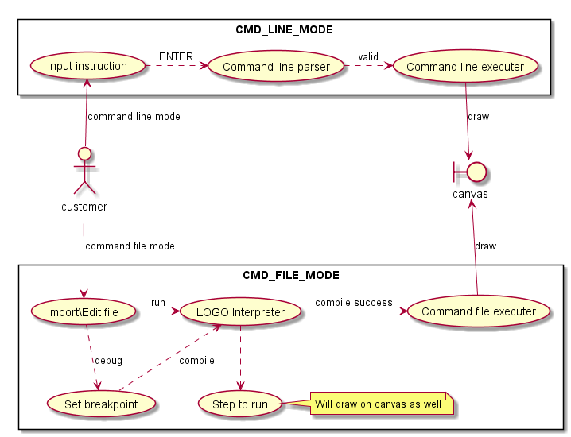
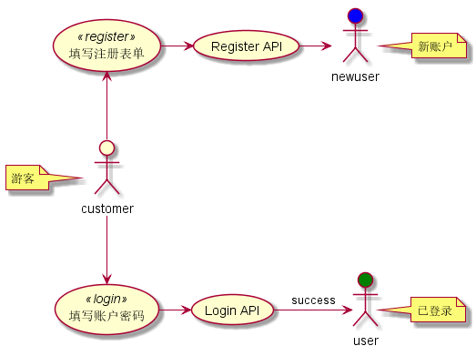
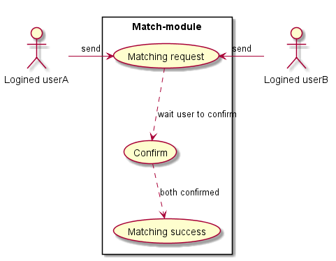
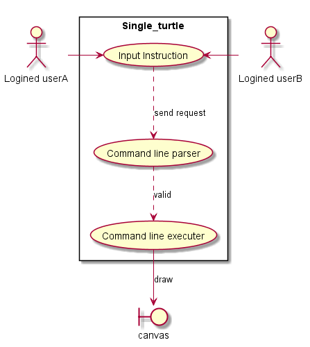
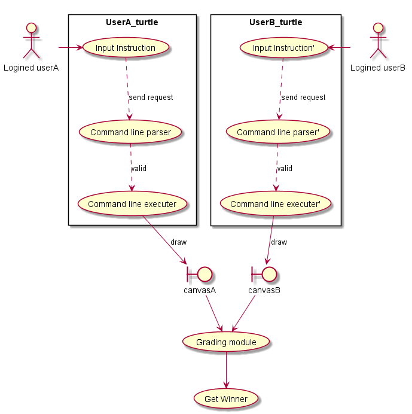

# Use-case Model

1. 绘制方便及简洁性起见，用例图中忽略了错误处理部分

2. 使用的绘制工具

    > 🛠 [PlantUML](https://plantuml.com/zh/download) + [Graghviz](https://www2.graphviz.org/Packages/stable/windows/10/cmake/Release/x64/)

3. 绘图的源码见目录 [use-case-puml](./use-case-puml/)

4. 参考资料 [PlantUML语言参考指引](http://plantuml.com/zh/guide)

## 单机模式

在单机模式下，用户可以有两种玩法

1. 命令行模式

    每一条指令输入后，经过解析器解析，确认合乎语法规范后，交付给执行器将结果绘制在画布上

    输入指令可以是直接键入命令行，或者使用自然语言通过语言方式（进阶需求）

2. 命令文件模式

    文件可以自行在编辑器上编写或者直接导入

    通过丰富的指令组合，解释器确认在合乎语法规范后，绘制出丰富多彩的图案

    也可设置断点进行调试，分步运行

## 联网模式

联网游戏主要有两种模式，即协作模式与对战模式

### 用户模块

若想联网游戏，用户需要拥有一个账户

- 游客可以选择填写注册信息注册新账户，用于联网模式。注册表单包含用户名，邮箱/电话号码，密码等信息

- 游客若已有账户，填写账号及密码，经后台验证成功后方可登录

### 匹配模块

在联网游戏之前，需要进行匹配寻找一起玩耍的小伙伴

- 已登录用户发送匹配请求，由后台自动匹配

- 匹配到小伙伴后，双方需要在有限时间内（如30秒）确认

- 双方均确认后建立连接，即可进行联网游戏

### 协作模式

网上双人单海龟协同绘图

已经匹配的小伙伴，通过轮流发送指令控制单个海龟绘图，每人需要在固定的操作时间限制内发送指令，否则海龟的控制转移到另一用户手中

### 对战模式

网上双人双海龟绘图对战

已经匹配的小伙伴，各自发送指令控制自己的海龟绘图，在规定时间结束后，经由评分模块通过一定的评分机制决出胜者
